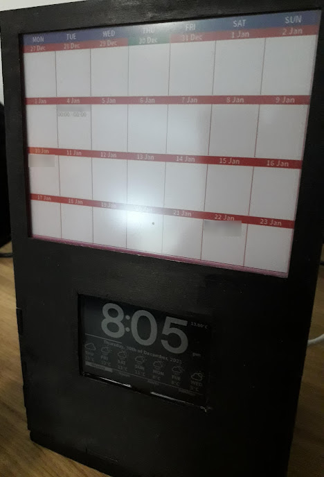
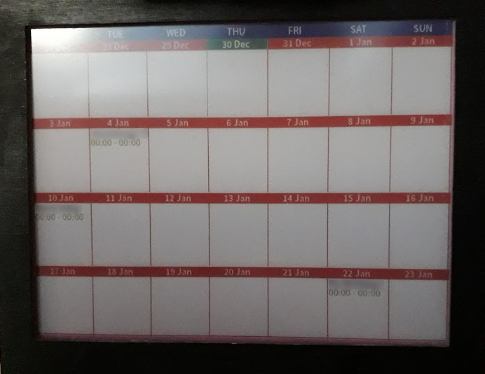

# Sharp LCD Display Clock and Pimoroni Inky Impression Calendar 

## Notes

Can I use the tplot library to make a ascii visualised (hehe) plotted chart for temp over time?
https://github.com/JeroenDelcour/tplot


## Description

I wanted a non-intrusive clock and calendar on my desk that could funtion as I wanted it to.
There's no snootiness there, I'm just very particular about things in my line of sight when I'm writing code, I wan't things that will tell me detail when I want to know, not when they think I have to know (thats a big difference to me), so I made this.




It all started when I got a [Inky Impression from PimoroniInky Impression](https://shop.pimoroni.com/products/inky-impression-5-7) to use as a display for my Google Calendar.
I chose this as I wanted something paper-like on my desk, something that didn't issue light as this would be less distracting (well, when it's not updating once an hour).



E-Ink displays are _awesome_ at being non-intrusive, the image is stable and just sits there, if you do lose power it doesn't care, it carries on showing the image, no state changes unless you tell it to.
...however they can be _quite_ distracting when they do update, especially if like me you have a display with multiple colours and you want to update the *whole canvas*. It looks like a Spectrum 48k if someone tripped over the headphone cable to the tape drive when it was loading something, so I only update once an hour (it's fine for a calendar).

So, E-Ink for calendar is excellent, really good use case, but I want a desk clock with it, and this has similar requirements. It should require minimal control, and be non-intrusive.

Non-intrusive to me means ideally not casting light, so I opted for a [Adafruit 2.7" LCD Sharp Display](https://shop.pimoroni.com/products/adafruit-sharp-memory-display-breakout-2-7-400x240-monochrome) as it has no backlight. 


## Detail

This whole thing was originally two seperate projects, but as times gone on I've pulled them together as there's a lot I want to use this for as I'm using the buttons on the Inky to change things and displaying the output on the LCD.

It's all in Python(3) because when I get to choose a language I like my languages to be friendly.

It uses 12h time because I prefer 12h time.

It uses Open Weather Map's API, if you want to use it you'll need a API key from them with the following environmental variables:

```
export OPENWEATHER={your open weather map api key}
export MYLOCATIONLAT={your lat}
export MYLOCATIONLONG={your long}
```

It uses a font with icons for the weather icons stashed in unicode addresses, so I've used [isneezy's open-weather-fonts](https://github.com/isneezy/open-weather-icons) for this as it was the only one I could bloody well find that had references between the OpenWeatherMap's icon codes and the Unicode character addresses so I could create a simple mapping betwixt the two. 
Massive shouts out to [isneezy](https://github.com/isneezy/) for this, I was dreading creating my own mapping.

The temperature to the right is pulled from a temperature sensor rig in my garden. You'll likely want to change that... ;)  

The line under the time is a seconds percentage bar for that minute :)

The Degrees C values (yes I also added a convertor helper function for the people out there that prefer Farenheit) are the 'feels like' values, cos frankly thats all I'm going to care about at a glance, if I want more then there is more available from this data set and I guess I'll need another screen or something. I dunno.

The Open Weather Map API is only called once an hour.
