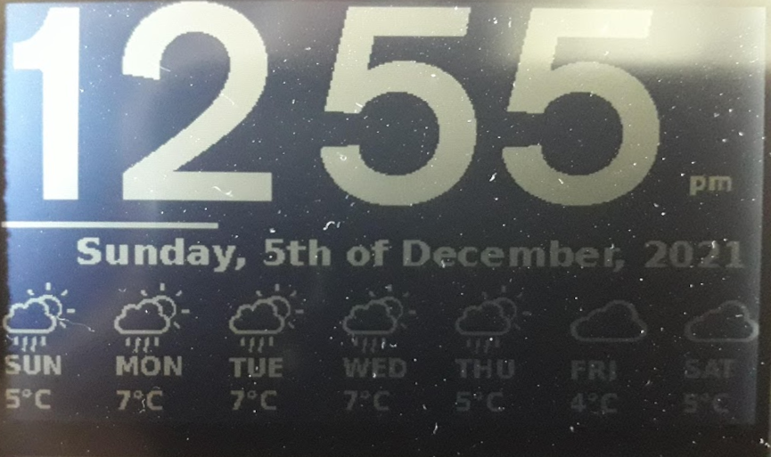

# Sharp LCD Display Clock

This project uses the [Adafruit 2.7" LCD Sharp Display](https://shop.pimoroni.com/products/adafruit-sharp-memory-display-breakout-2-7-400x240-monochrome)



It's a Clock.
It uses 12h time because I prefer 12h time.
It uses Open Weather Map's API, if you want to use it you'll need a API key from them with the following environmental variables:

```
export OPENWEATHER={your open weather map api key}
export MYLOCATIONLAT={your lat}
export MYLOCATIONLONG={your long}
```

It uses a font with icons for the weather icons stashed in unicode addresses, so I've used [isneezy's open-weather-fonts](https://github.com/isneezy/open-weather-icons) for this as it was the only one I could bloody well find that had references between the OpenWeatherMap's icon codes and the Unicode character addresses so I could create a simple mapping betwixt the two. 
Massive shouts out to isneezy for this, I was dreading creating my own mapping.

The line under the time is a seconds percentage bar for that minute :)

The Degrees C values (yes I also added a convertor helper function for the people out there that prefer Farenheit) are the 'feels like' values, cos frankly thats all I'm going to care abuot at a glance, if I want more then there is more available from this data set and I guess I'll need another screen or something. I dunno.

Oh and the Open Weather Map API is only called once an hour.

Anything else, fire me an email at [chris@headstrong.solutions](chris@headstrong.solutions) or open an issue here.